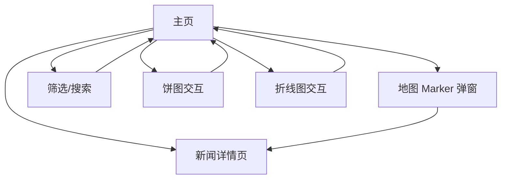

## 1. Product Overview
面向公众的“新闻世界地图可视化”站点：用世界地图与数据图表帮助你快速理解新闻的地域分布与时间趋势。
你可以从新闻列表或地图 Marker 进入新闻内容，并通过右侧图表做聚合分析。

## 2. Core Features

### 2.1 Feature Module
本产品需求由以下主要页面组成：
1. **主页（地图 + 新闻列表 + 图表）**：地图可视化、新闻列表、筛选/搜索、列表与 Marker/弹窗联动、右侧饼图与折线图联动、性能与规范约束。
2. **新闻详情页**：新闻正文、来源/时间/地点信息、与地图位置的关联展示、返回与继续浏览。

### 2.3 Page Details
| Page Name | Module Name | Feature description |
|---|---|---|
| 主页（地图 + 新闻列表 + 图表） | 顶部导航/页头 | 展示站点名称与关键入口（回到顶部、刷新数据）；在保持简洁的前提下承载全局筛选入口。 |
| 主页（地图 + 新闻列表 + 图表） | 新闻筛选与搜索 | 按关键词/时间范围/主题（如有）筛选；触发后驱动列表、地图 Marker、右侧图表同步更新。 |
| 主页（地图 + 新闻列表 + 图表） | 新闻列表 | 列表展示标题、时间、来源、地点；支持滚动与选中态；点击条目将定位/高亮对应 Marker 并打开弹窗。 |
| 主页（地图 + 新闻列表 + 图表） | 世界地图 + Marker | 在世界地图上展示新闻点位 Marker；点击 Marker 高亮对应列表项并展开弹窗；支持基础缩放/拖拽。 |
| 主页（地图 + 新闻列表 + 图表） | Marker 弹窗 | 展示该新闻的关键信息（标题/摘要/时间/来源）；提供“查看详情”进入新闻详情页。 |
| 主页（地图 + 新闻列表 + 图表） | 右侧饼图（分布） | 展示当前筛选集的分布占比（如地区/主题/来源之一，按 Figma 定义）；点击扇区将进一步过滤并联动列表/地图。 |
| 主页（地图 + 新闻列表 + 图表） | 右侧折线图（趋势） | 展示当前筛选集的时间趋势（按天/周，按 Figma 定义）；支持悬停提示；拖拽/点击区间触发时间范围筛选并联动。 |
| 主页（地图 + 新闻列表 + 图表） | 联动规则（核心） | 保证“列表选中=Marker 高亮+弹窗打开”；“Marker 点击=列表滚动定位+选中”；“图表交互=筛选条件更新并同步影响列表/地图/图表”。 |
| 主页（地图 + 新闻列表 + 图表） | 性能与代码规范约束 | 保证列表与地图交互流畅；明确渲染/数据更新边界；遵守工程与代码规范（详见技术架构文档中的约束）。 |
| 新闻详情页 | 内容展示 | 展示标题、正文/摘要、时间、来源、地点与坐标（如有）；提供返回主页。 |
| 新闻详情页 | 地图关联（轻量） | 展示该新闻的单点位置（或静态小地图/只读地图）；与正文信息一致。 |

## 3. Core Process
- 主页浏览流：你进入主页后默认看到“地图 + 新闻列表 + 图表”。你可以通过搜索/筛选缩小范围，列表、Marker 与图表会同步刷新。
- 列表驱动地图：你点击某条新闻，地图自动定位到对应 Marker 并打开弹窗；弹窗中可直接进入详情页。
- 地图驱动列表：你点击某个 Marker，列表自动滚动并高亮对应新闻；右侧图表保持当前筛选集一致。
- 图表驱动筛选：你点击饼图扇区或在折线图选择时间区间，会更新筛选条件，并联动刷新列表与地图展示。

