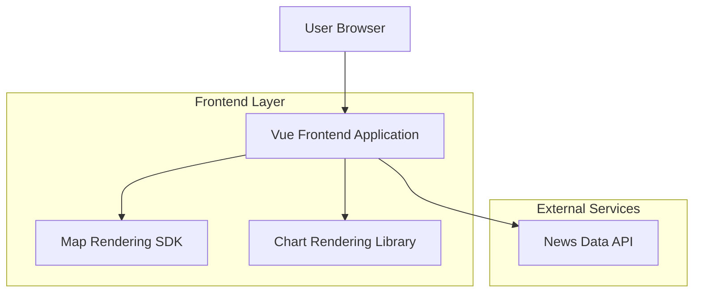

## 1.Architecture design

## 2.Technology Description
- Frontend: Vue@3 + TypeScript + vite
- Styling: tailwindcss@3
- Map: Leaflet（Google Maps 瓦片底图），支持 Marker/Popup、缩放/拖拽、程序化定位
- Charts: ECharts（Pie + Line + tooltip + 区间选择）
- Backend: None（前端内置 mock 数据；后续可切换为 News Data API）

## 3.Route definitions
| Route | Purpose |
|---|---|
| / | 主页：地图 + 新闻列表 + 饼图 + 折线图联动分析 |
| /news/:id | 新闻详情页：阅读内容与地点关联展示 |

## 4.Performance constraints（强约束）
- 列表渲染：新闻列表必须使用虚拟列表（只渲染可视区域），避免大量 DOM 导致卡顿。
- 地图更新：Marker 渲染需做聚合/分层策略（若点位过多），避免一次性渲染上千个 Marker；视图变化（缩放/拖拽）时增量更新。
- 状态驱动：筛选条件变化后，使用 memoization（useMemo/useCallback）与 selector（如有）减少不必要的重渲染。
- 事件节流：地图 move/zoom、鼠标 hover 等高频事件必须 throttle/debounce。
- 数据请求：筛选触发请求需可取消（AbortController）以避免竞态；同条件请求需缓存（至少内存级）。
- 交互延迟目标：列表选中联动地图定位与弹窗打开在常规设备上应保持“即时”（避免明显掉帧）。

## 5.Code conventions（强约束）
- TypeScript 强类型：为 News、GeoPoint、FilterState、ChartSeries 等定义明确类型；禁止 any（除非第三方库类型缺失且有注释说明）。
- 单向数据流：以“筛选条件 FilterState”为单一事实来源；列表/地图/图表都从同一派生数据计算。
- 组件分层：
  - pages：页面级容器（负责路由与组合）
  - features：地图联动、图表联动、筛选逻辑
  - components：纯 UI 组件（基于 Figma 组件）
  - lib：工具函数（节流、缓存、坐标转换等）
- 可测试性：核心联动规则（选中态、筛选派生、图表点击过滤）需可用纯函数/轻量单测覆盖。
- 可访问性：可点击列表项与图表关键交互需可聚焦与键盘触发（至少 Enter/Space）。

## 6.Data model(if applicable)
无（本期仅消费新闻数据 API，不在站点内持久化）。
